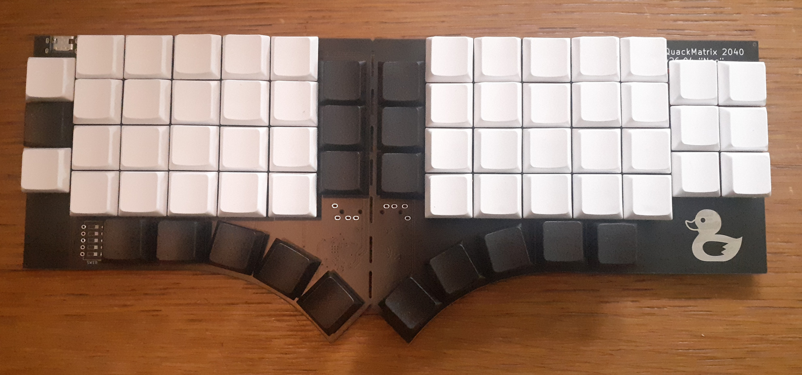

# QMx 2040

The Extremely Normal Keyboard.
A natural evolution of the TypeMatrix 2020 and 2030 series.

## Project

The geometry is an attempt to have a modern matrix layout on an ISO-compatible keyboard.
More info on the website: https://onedeadkey.github.io/qmx2040

The conception is derived from [Nuclear-Squid]’s [Quacken]:

- the electronic design is still ongoing, files will be published shortly
- the [ZMK firmware] implements a dedicated keymap, derived from [Arsenik]

If you want to build or submit a case for this keeb, here’s the FreeCAD source:

- [QMx2040.FCStd](QMx2040.FCStd)

[Arsenik]:       https://github.com/OneDeadKey/arsenik
[Quacken]:       https://github.com/OneDeadKey/quacken
[ZMK firmware]:  https://github.com/Nuclear-Squid/zmk-keyboard-qmx2040
[Nuclear-Squid]: https://github.com/Nuclear-Squid

## Roadmap

- [x] onboard RP2040 (left) and I/O expander (right)
- [x] splittable in two (I²C communication over a TRRS cable)
- [X] hotswap sockets
- [ ] optional rotary encoders
